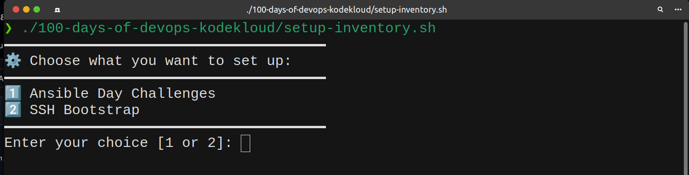

# My 100 Days of DevOps Journey


**My personal automation solutions for the 100 Days of DevOps challenge.**

This repository contains my automation scripts and solutions for daily DevOps challenges where automation is necessary using Ansible, Bash, and Python scripting.

## 🛠 Technologies Used

- **Ansible** - Configuration management and orchestration

## 🎯 Purpose

Automating repetitive tasks and complex configurations encountered during the 100 Days of DevOps challenge, focusing on practical solutions that save time and reduce manual errors.


## Setup
### Install Ansible (CentOS)
   ```bash
   sudo dnf install epel-release -y
   sudo dnf install ansible -y
   ansible --version
   ```

### Usage
- Ensure you have Ansible installed on your jump host.

- Clone repo
    ```
    git clone https://github.com/godcandidate/100-days-of-devops-kodekloud.git
    ```

- Run make the script executable
    ```
    chmod +x ./100-days-of-devops-kodekloud/setup-inventory.sh
    ```

- Execute the script
    ```
    ./100-days-of-devops-kodekloud/setup-inventory.sh
    ```

- Choose your use case
<p align="center">  </p>


## 🛠️ Requirements

* Ansible ≥ 2.10
* Python ≥ 3.6 on all hosts
* SSH access to all servers (initially via password)