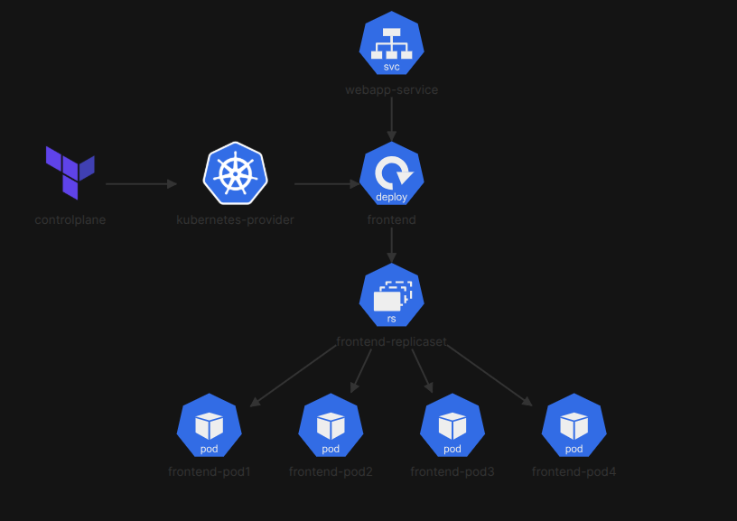

# Deploy WebApp with Terraform
In this challenge, you will deploy a simple web application using Terraform and Kubernetes. You will create a Kubernetes Deployment resource to manage the application pods.

# Architecture

  

